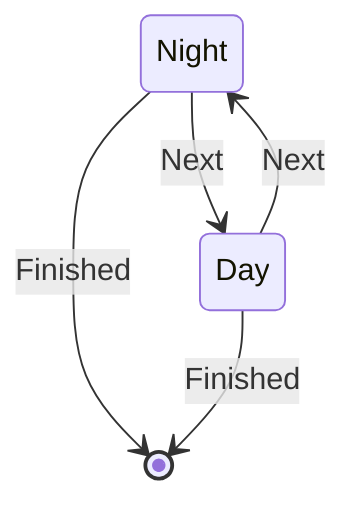

# Werewolf State Machine

This implements the following state machine to model game flow in the social
deception game Werewolf.



Players take action by sending `GameMessage` objects to `WerewolfMachine` as appropriate.

## Usage

Run the interactive demo:

```bash
python src/werewolf.py
```

At the prompt, enter one of the following commands:

- `next` (`n`) – toggle between Night and Day
- `finish` (`f`) – end the game
- `quit` (`q`) – exit the demo
